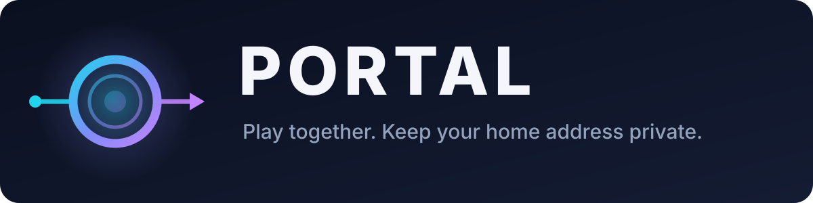
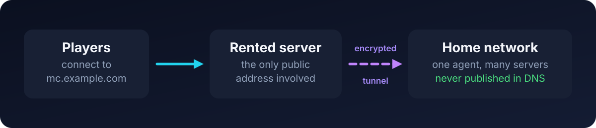

<p align="center">
  
</p>

<p align="center">
  <a href="https://github.com/scopeddlol/portal/actions/workflows/release.yml"></a>
  
  <a href="LICENSE"></a>
  
  
  
</p>

<p align="center">
  <b>Let friends join game servers on your home PC — without touching your router or sharing your home address.</b>
</p>

---

## What is this?

You want to run a Minecraft server on your own PC and have friends join. Normally that means two uncomfortable things: opening a port on your home router, and handing out your home IP address — which quietly tells people roughly where you live.

Portal removes both. You rent a small server somewhere (about **$5 a month**), and Portal joins your home PC to it through a private, encrypted tunnel. Friends connect to a normal address like `mc.yourdomain.com`, which points at the **rented** server. Your home address is never published, and nothing on your router changes.

<p align="center">
  
</p>

Portal also handles the fiddly parts for you: it picks the port numbers, writes the DNS records so your address just works, and knows that a Minecraft server with voice chat needs two ports rather than one.

## What you need

| | |
| --- | --- |
| 🌐 **A domain name** | Managed by Cloudflare. Roughly $10 a year. |
| 🖥️ **A small rented server** | Any cheap Linux VPS with a public IP. About $5 a month. |
| 🏠 **A home PC** | Running Linux or Docker, where your game servers live. |

## Setup

No cloning, no compiler, no build. Four small files on the rented server and one at home.

### 1. On the rented server

First, in your Cloudflare dashboard, add one **A record**: `portal` → your server's IP, with the orange cloud **off**. That's the address you'll manage everything from.

Then make a folder and put these four files in it.

<details open>
<summary><b>compose.yml</b></summary>

```yaml
services:
  gateway:
    image: ghcr.io/scopeddlol/portal-gateway:beta
    container_name: portal-gateway
    restart: unless-stopped
    network_mode: host
    cap_add: [NET_ADMIN]
    volumes:
      - portal-data:/var/lib/portal
      - ./config.toml:/etc/portal/config.toml:ro
    env_file: [.env]

  caddy:
    image: caddy:2-alpine
    container_name: portal-caddy
    restart: unless-stopped
    network_mode: host
    volumes:
      - ./Caddyfile:/etc/caddy/Caddyfile:ro
      - caddy-data:/data

volumes:
  portal-data:
  caddy-data:
```
</details>

<details open>
<summary><b>config.toml</b> — change the four values</summary>

```toml
[gateway]
public_ip = "203.0.113.10"        # your rented server's public IP
zone = "yourdomain.com"           # your domain
reserved_tcp_ports = [80, 443]    # leave these for the control panel

[tunnel]
endpoint = "203.0.113.10:51820"   # the same IP, agents dial this

[cloudflare]
zone_id = "0123456789abcdef"      # Cloudflare dashboard → your domain → overview
```
</details>

<details open>
<summary><b>Caddyfile</b> — gives the panel a padlock, automatically</summary>

```caddyfile
portal.yourdomain.com {
	reverse_proxy 127.0.0.1:8080
}
```
</details>

<details open>
<summary><b>.env</b> — your two secrets</summary>

```ini
PORTAL_CF_API_TOKEN=your-cloudflare-api-token
PORTAL_ADMIN_TOKEN=make-up-a-long-random-password
```

The Cloudflare token comes from **My Profile → API Tokens** and needs exactly one permission: **Zone → DNS → Edit**.
</details>

Then start it:

```bash
chmod 600 .env

# Without this, the server quietly drops every game packet.
echo 'net.ipv4.ip_forward=1' | sudo tee /etc/sysctl.d/99-portal.conf
sudo sysctl --system

docker compose up -d
```

Make sure ports **80**, **443** and **UDP 51820** are open on your server's firewall — the first two get the panel its certificate, the last one is the tunnel.

### 2. Open the control panel

Go to **https://portal.yourdomain.com** and sign in with your `PORTAL_ADMIN_TOKEN`.

Click **Create enrollment token** and copy what it gives you — it's shown once and lasts an hour.

### 3. On your home PC

One file:

<details open>
<summary><b>agent-compose.yml</b></summary>

```yaml
services:
  agent:
    image: ghcr.io/scopeddlol/portal-agent:beta
    container_name: portal-agent
    restart: unless-stopped
    network_mode: host
    cap_add: [NET_ADMIN]
    volumes:
      - agent-data:/var/lib/portal-agent

volumes:
  agent-data:
```
</details>

Register it once, then leave it running:

```bash
docker compose -f agent-compose.yml run --rm agent \
  enroll --gateway https://portal.yourdomain.com --token PASTE_TOKEN_HERE --name my-pc

docker compose -f agent-compose.yml up -d
```

### 4. Add your game server

Back in the control panel: pick your PC, name the server, choose an address like `mc`, tick the games it runs, and press **Create**.

Your friends can now connect to `mc.yourdomain.com`.

> [!NOTE]
> The images above land in the registry with the first published release. Until then — or if you'd rather build it yourself — see [building from source](deploy/README.md#not-using-the-published-images).

## Games it knows about

| Game | Notes |
| --- | --- |
| 🟩 **Minecraft (Java)** | Friends type just `mc.yourdomain.com`, no port number needed |
| 🟦 **Minecraft (Bedrock)** | Consoles and phones can join too |
| 🎙️ **Simple Voice Chat** | Add-on for Java — tick it alongside Minecraft |
| 🧪 **Hytale** | Placeholder — the port numbers are guesses until the game exists |

Adding another game is one small text file, not a code change. See [`profiles/`](profiles/).

## Good to know

This is a **beta**. It works, but a few things are worth knowing before you rely on it:

- **Your home PC needs Linux or Docker.** A native Windows version is planned but not built yet.
- **Your game server sees one address for everyone.** Player IP addresses arrive looking identical, so IP bans and IP-based plugins won't behave as you'd expect.
- **IPv4 only** for now.
- **You still set your own game config.** If you use voice chat, the web page tells you exactly which line to change and where — Portal won't edit your server files behind your back.

## Learn more

- 📘 [**Full setup and troubleshooting**](deploy/README.md) — building from source, running without Docker, checking it works
- 🔧 [**How it works inside**](docs/how-it-works.md) — the architecture, why Cloudflare can't carry game traffic, and the design decisions
- 🧩 [**Game profiles**](profiles/) — add support for another game

## Licence

MIT. See [LICENSE](LICENSE).
